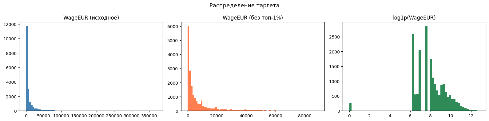
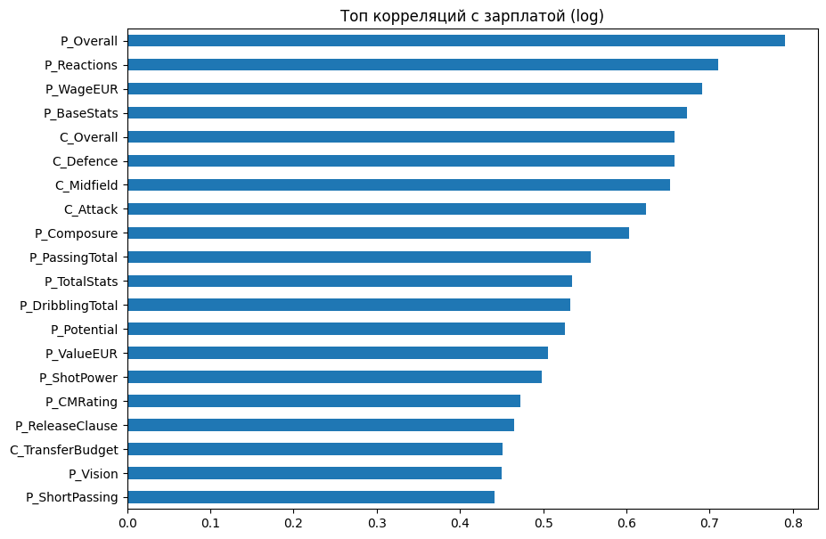
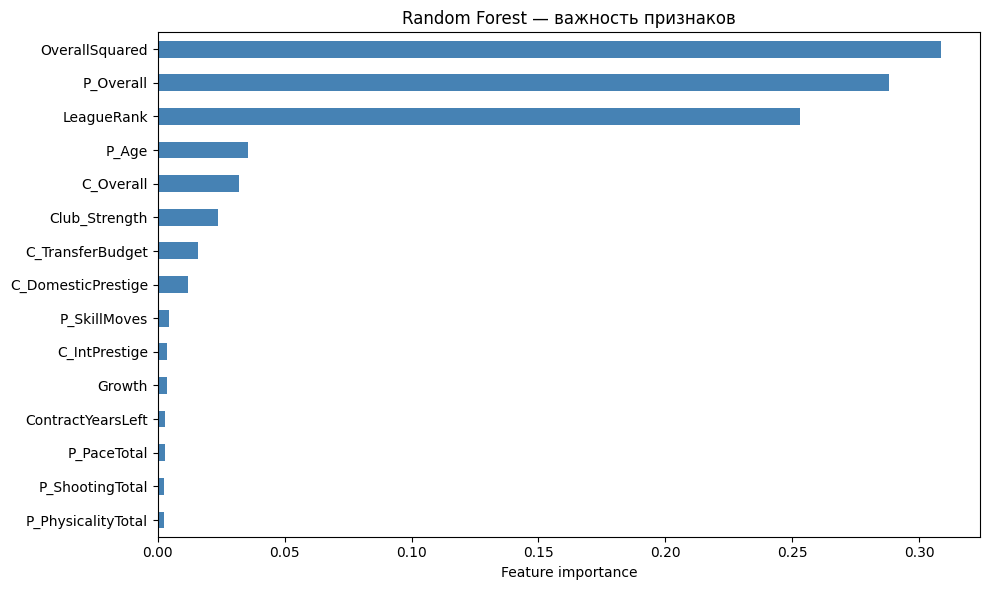
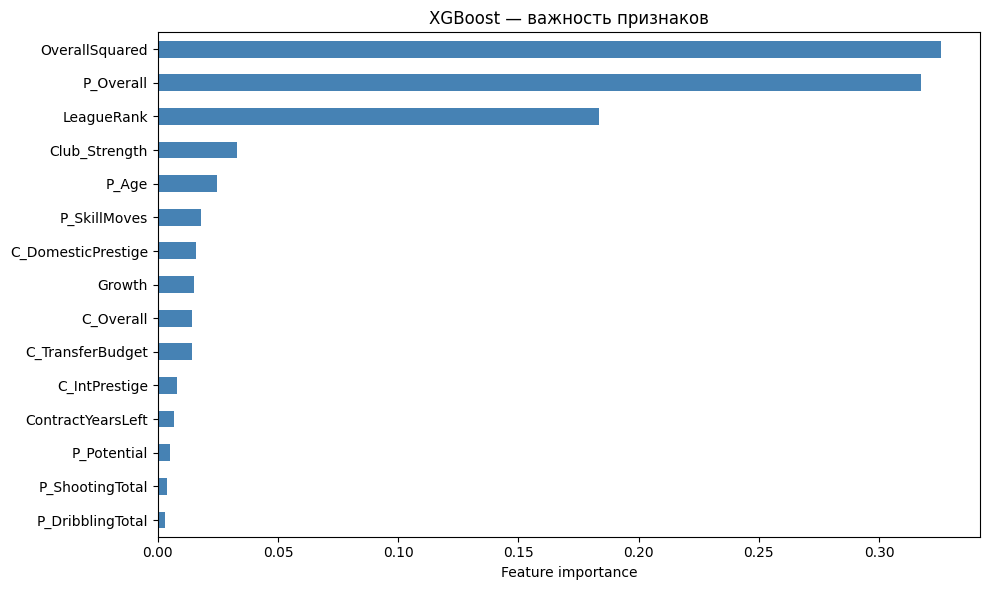
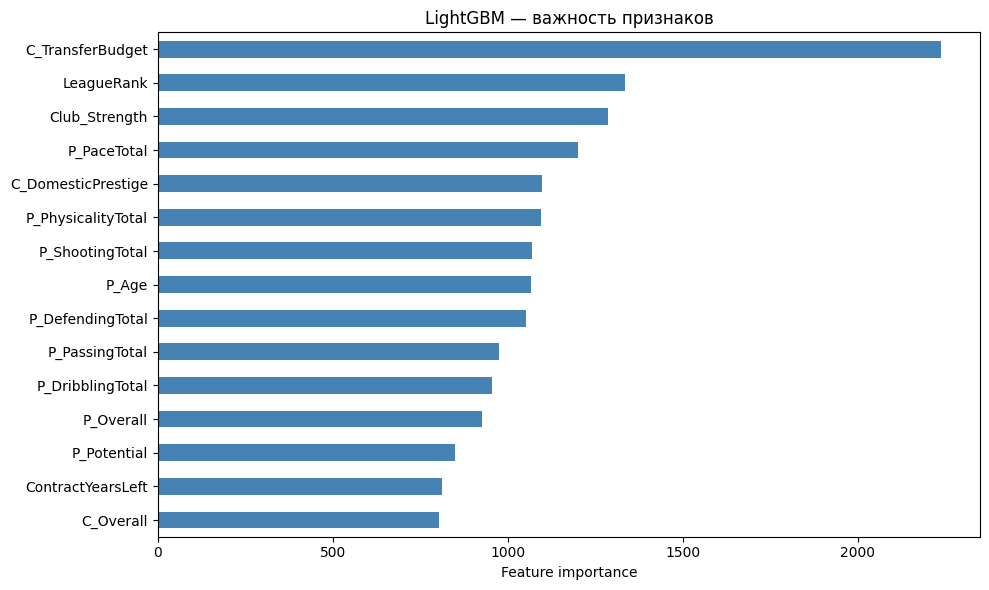
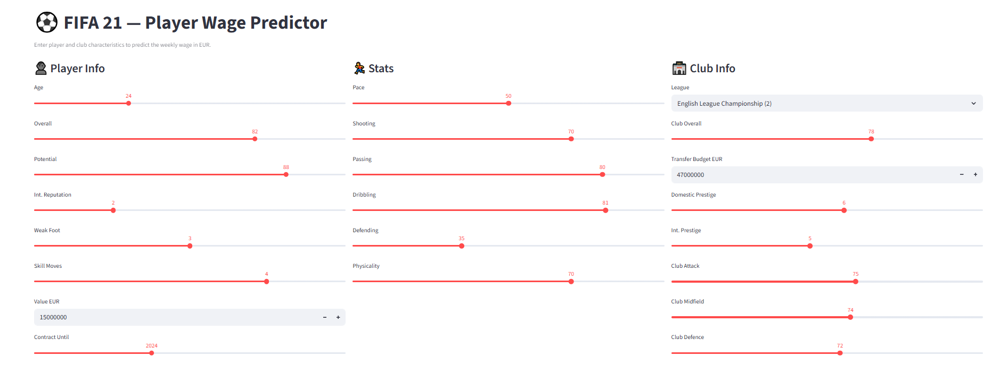
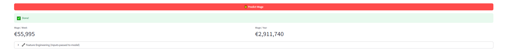

# Отчёт по проекту

**Студент:** Панов Елисей Николаевич

**Группа:** 234

---

## 1. Введение и постановка задачи

- **Цель проекта:** В данном проекте предсказывается зарплата футболиста по его характеристикам. Это нужно скаутам для формирования примерной оценки зарплаты. 
- **Формулировка задачи:** Регрессия
- **Обоснование метрики качества:** RMSE, MAE, R2 и MAPE. RMSE было использовано как главная метрика, так как я работал в log пространстве, а метрика считается там же и ошибка в логе примерно равна относительной ошибке в реальных деньгах: ошибиться на 5M у игрока за 10M и у игрока за 100M - принципиально разные вещи.
---

## 2. Поиск и описание данных

- **Источник данных:** Датасеты найдены на kaggle, так как нужно было monetary и большое количество фичей. Также я люблю спорт и обсуждение зарплат Российской сборной всегда поражало меня. [FIFA 21 Players & Teams - Full Database](https://www.kaggle.com/datasets/cashncarry/fifa-21-players-teams-full-database)

- **Описание датасета:**

| Датасеты | Строки | Столбцы |
|-------|--------|----------|
| Teams | 19 020 | 90 |
| Clubs | 731    | 14 |

- **Описание признаков после подготовки данных**

Характеристики игрока

| Признак | Описание |
|---------|----------|
| P_Age | Возраст |
| P_Overall | Общий рейтинг |
| P_Potential | Потенциал |
| P_IntReputation | Международная репутация |
| P_WeakFoot | Сила слабой ноги |
| P_SkillMoves | Уровень финтов |

Игровая статистика

| Признак | Описание |
|---------|----------|
| P_PaceTotal | Скорость |
| P_ShootingTotal | Удар |
| P_PassingTotal | Пас |
| P_DribblingTotal | Дриблинг |
| P_DefendingTotal | Защита |
| P_PhysicalityTotal | Физическая форма |

Характеристики клуба

| Признак | Описание |
|---------|----------|
| C_Overall | Рейтинг клуба |
| C_TransferBudget | Трансферный бюджет |
| C_DomesticPrestige | Внутренний престиж |
| C_IntPrestige | Международный престиж |

Feature Engineering

| Признак | Смысл |
|---------|-------|
| Growth | Разница между Potential и Overall |
| OverallSquared | Нелинейный рост зарплат у топ-игроков |
| ContractYearsLeft | Количество лет до конца контракта |
| Club_Strength | Средняя сила клуба |
| LeagueRank | Ранг лиги по медианной зарплате |
| IsTopLeague | Флаг топ-5 лиг |
| AgeGroup | Возрастная категория игрока |
| ValuePerOverall | Рыночная стоимость на единицу рейтинга |
---

## 3. Обработка и подготовка данных

**Очистка данных:**

Были удалены:

  - свободные агенты;
  - записи с нулевой зарплатой;
  - строки без информации о клубе;
  - дубликаты игроков.

Также было выполнено:

  - удаление выбросов (топ-1% зарплат);
  - заполнение пропусков медианой;
  - заполнение категориальных пропусков значением Unknown.

После очистки осталось 18 572 строки.

**Работа с фичами:**

  - мerge, после которого стало 104 столбца
  - Feature Engineering

**Визуализации:** 

**Сплит данных**
  - соотношение: **Train 70% / Val 15% / Test 15%**
  - целевая переменная `log(WageEUR)` была разделена на 5 равных групп. Из каждой группы в train, val и test попало одинаковое количество объектов. Это гарантирует, что во всех выборках соотношение низко- и высокооплачиваемых игроков одинаково, и качество модели не страдает из-за неудачного случайного разбиения.

**Предотвращение Data Leakage**

  - split выполнялся до feature engineering;
  - LeagueRank вычислялся только по train-выборке;
  - словарь рангов применялся отдельно к val/test.

**Результат:**
| Сплит | Размер |
|-------|--------|
| Train | 12,999 |
| Val   | 2,787  |
| Test  | 2,786  |

---

## 4. Baseline-модель

- **Модели:** 

| Модель | Описание |
|--------|----------|
| **Median baseline** | Предсказание медианы |
| **Linear Regression** | Линейная регрессия |
| **Ridge Regression** | Линейная регрессия с L2-регуляризацией |
| **KNN (k=10)** | Метод ближайших соседей |

- **Результаты:** 

| Модель | RMSE | MAE | R² | MAPE |
|--------|------------|-----------|-----|-----------|
| Linear Regression | 0.4827 | 0.3624 | 0.8652 | 39.52 |
| Ridge Regression | 0.4828 | 0.3624 | 0.8651 | 39.53 |
| KNN (k=10) | 0.4877 | 0.3689 | 0.8624 | 41.52 |
| Median baseline | 1.3158 | 1.0849 | -0.0020 | 144.24 |

- **Цель:** 

Точка отсчёта для сравнения с более сложными моделями

---

## 5. Эксперименты

**Базовый уровень:** Ridge — RMSE = 0.483 (из 02_baseline)

---

**Эксперимент 1. Random Forest**

- **Гипотеза:** Ансамбль деревьев с бэггингом даст значительный прирост над линейными моделями за счёт улавливания нелинейностей.

- **Как проверялось:** Обучен `RandomForestRegressor` с параметрами `n_estimators=300`, `max_depth=12`, `min_samples_leaf=4`. Оценка на валидационной выборке.

- **Результат:** RMSE = 0.324, MAE = 0.223, R² = 0.939

---

**Эксперимент 2. XGBoost**

- **Гипотеза:** Предполагалось, что XGBoost сможет лучше уловить сложные зависимости.

- **Как проверялось:** Обучен `XGBRegressor` с параметрами `n_estimators=500`, `learning_rate=0.05`, `max_depth=6`, `subsample=0.8`, `colsample_bytree=0.8`. Оценка на валидационной выборке.

- **Результат:** RMSE = 0.264, MAE = 0.172, R² = 0.960

---

**Эксперимент 3. LightGBM с подбором гиперпараметров**

- **Гипотеза:** Подбор гиперпараметров улучшит качество модели.

- **Как проверялось:** `RandomizedSearchCV` (20 итераций, cv=3) по сетке: `num_leaves=[31,63,127]`, `learning_rate=[0.01,0.03,0.05,0.1]`, `min_child_samples=[10,20,50]`, `subsample=[0.7,0.8,0.9]`, `colsample_bytree=[0.7,0.8,0.9]`.

- **Результат:** Лучшие параметры: `subsample=0.9`, `num_leaves=63`, `min_child_samples=10`, `learning_rate=0.1`, `colsample_bytree=0.9`. CV RMSE = 0.274. Валидационный RMSE = 0.263, MAE = 0.170, R² = 0.960.

---

**Эксперимент 4. Stacking (ансамбль моделей)**

- **Гипотеза:** Комбинация предсказаний базовых моделей через мета-модель даст более стабильный и точный результат.

- **Как проверялось:** `StackingRegressor` с базовыми моделями (RF, XGB, LGBM) и финальным `Ridge`. Для генерации предсказаний использована 5-блочная кросс-валидация (`cv=5`).

- **Результат:** RMSE = 0.262, MAE = 0.172, R² = 0.960

---

**Эксперимент 5. Финальная оценка на тесте**

- **Гипотеза:** Лучшая модель (Stacking) сохранит качество на невидимых данных.

- **Как проверялось:** Модель переобучена на объединённых `train+val` и оценена на тестовой выборке.

- **Результат:** RMSE = 0.260, MAE = 0.166, R² = 0.961, MAPE = 16.56%

---

**Сводная таблица**

| Модель | RMSE | MAE | R² |
|--------|------|-----|-----|
| Ridge (baseline) | 0.483 | — | — |
| Random Forest | 0.324 | 0.223 | 0.939 |
| XGBoost | 0.264 | 0.172 | 0.960 |
| LightGBM | 0.263 | 0.170 | 0.960 |
| Stacking | 0.262 | 0.172 | 0.960 |
| Stacking (test+val) | 0.260 | 0.166 | 0.961 |

---

## 6. Финальная модель и интерпретируемость

**Выбор модели**

Из всех экспериментов лучше всех показал себя **Stacking** (RF + XGB + LGBM → Ridge). На валидации RMSE = 0.262, на тесте - 0.260. Переобучения нет, модель стабильная.

**Что влияет на зарплату**
Важность признаков пдля Random Forest:

Важность признаков для XGBoost:

Важность признаков для LightGBM:

**Топ факторов (по всем трём моделям):**

| Признак | Что значит |
|---------|-------------|
| `OverallSquared` | Квадрат рейтинга игрока (усиливает разрыв между звёздами и середняками) |
| `P_Overall` | Общий рейтинг игрока |
| `C_Overall` | Рейтинг клуба |
| `Growth` | Потенциал роста (разница между потенциалом и текущим рейтингом) |
| `P_Potential` | Максимальный потенциал |

Главный вывод:
- зарплата в первую очередь зависит от уровня игрока;
- сильные клубы платят больше;
- топ-лиги значительно влияют на уровень зарплат.

---

## 7. Деплой

- **Интерфейс:** Streamlit
- **API:** FastAPI
- **Скриншоты** 

- [**Ссылка на видео**](https://disk.yandex.ru/i/jIvtmWMxDazsjA)

---

## 8. Заключение и выводы

- **Итоги:** 
В ходе работы была разработана модель для предсказания зарплаты футболистов FIFA 21 на основе их характеристик и параметров клуба.

Основные результаты:

| Показатель | Baseline (Ridge) | Финальная модель (Stacking) | Улучшение |
|------------|------------------|----------------------------|-----------|
| RMSE | 0.483 | 0.260 | 46% |
| R² | 0.864 | 0.961 | 11% |
| MAPE | 39.5 | 16.6 | 58% |

**Что удалось:**
- снизить ошибку предсказания почти в 2 раза по сравнению с линейной моделью
- построить пайплайн с визуализацией важности признаков
- разработать веб-интерфейс для использования модели

**Ограничения:** 
- данные относятся только к FIFA 21;
- рынок зарплат со временем меняется;
- ошибка для топ-игроков в абсолютных числах остаётся большой.

**Возможные улучшения:** 
- добавить позицию игрока как категориальный признак;
- попробовать CatBoost;
- использовать более свежие данные;